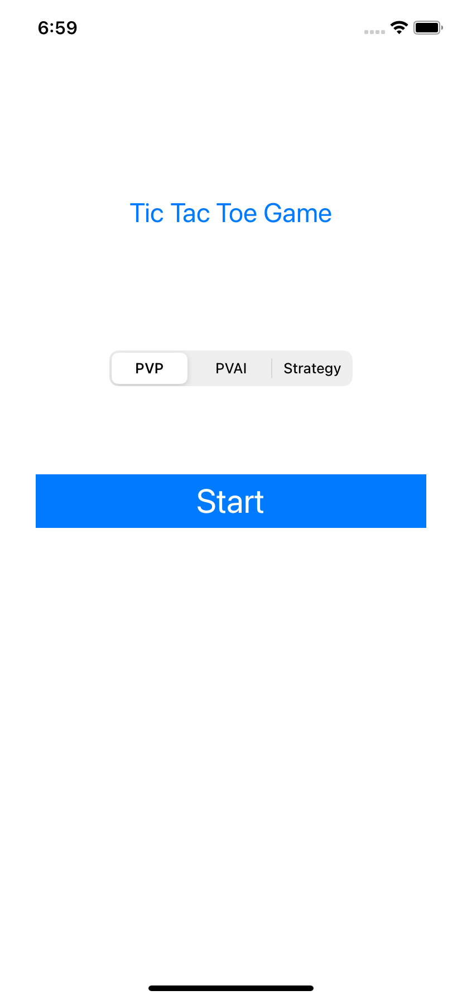
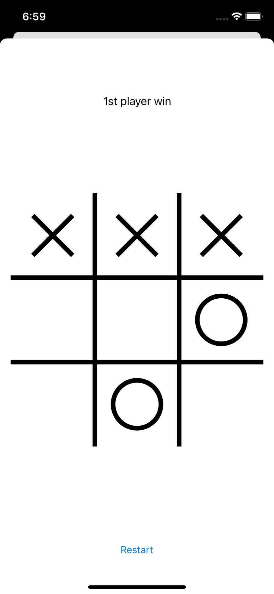
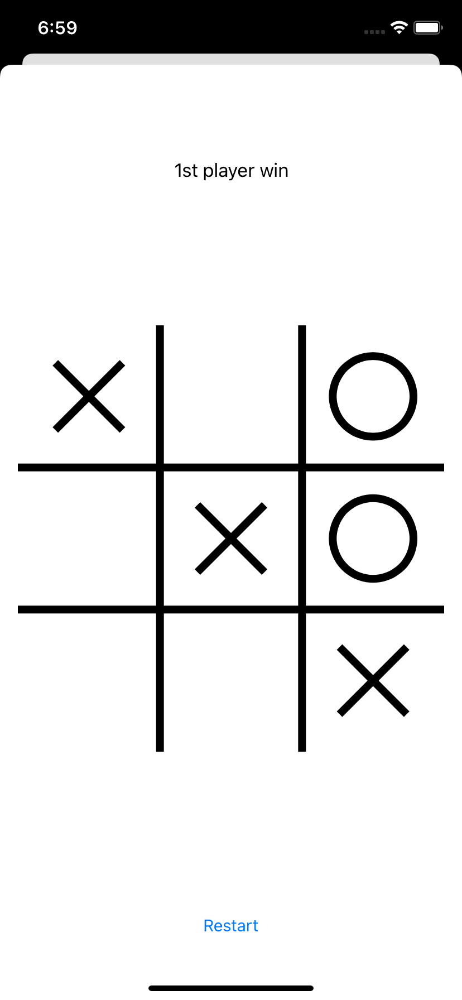

# TicTacToeGame

## Цель проекта
- изучаение паттернов проектирования
- применение паттернов на практике

## Какие паттерны были применены в проекте?
- State;
- Strategy;

## Функционал:
- Игра против второго игрока;
- Игра против искусственного интеллекта.

## Примеры экранов:

       
       

